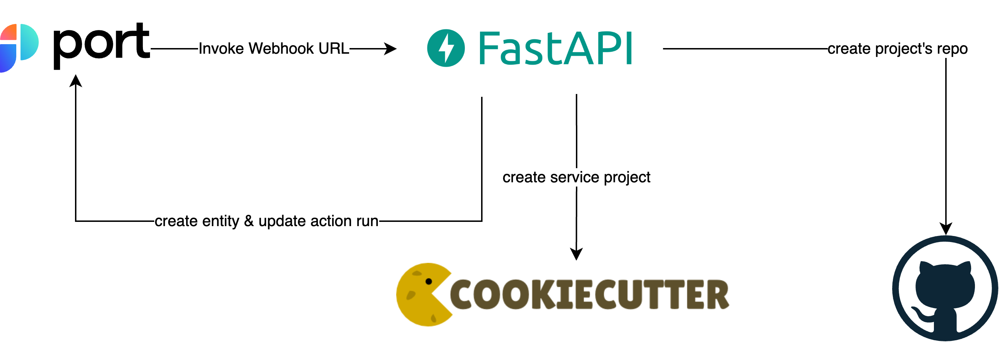

 

# port-cookiecutter-example

[](https://join.slack.com/t/devex-community/shared_invite/zt-1bmf5621e-GGfuJdMPK2D8UN58qL4E_g)

Port is the Developer Platform meant to supercharge your DevOps and Developers, and allow you to regain control of your environment.

## Docs

- [Port Docs](https://docs.getport.io/tutorials/complete-use-cases/software-templates)

## Description

The following example creates service GitHub repository from Cookiecutter repository.

This example consists of a FastAPI backend, that listen for Port Action Webhook events.

For each event, the backend creates new project using Cookiecutter, and new GitHub repository to host the project.

Finally, the backend creates new Port Entity for `Service` blueprint, and updates Port Action run.

## Table of Contents

1. [Local Setup](#Localhost)
2. [Webhook Setup](#Webhook)
3. [Port Setup](#Port)

## Diagram



## Setup

### Localhost

1. Make sure that the Docker daemon is available and running

```
$ docker info
```

2. Create `.env` file with the required environment variables

```
$ cat .env

PORT_CLIENT_ID=<PORT_CLIENT_ID>
PORT_CLIENT_SECRET=<PORT_CLIENT_SECRET>
GH_ACCESS_TOKEN=<GH_ACCESS_TOKEN>
```

Make sure your `GH_ACCESS_TOKEN` has relevant scopes for create new repository in your organization, and push to it.

3. Build example's Docker image

```
$ docker build -t getport.io/port-cookiecutter-example .
```

4. Run example's Docker image with `.env`

To change the default port (`80`) to `8080` for example, replace command's flags with the following: `-p 80:8080 -e PORT="8080"`

```
$ docker run -d --name getport.io-port-cookiecutter-example -p 80:80 --env-file .env getport.io/port-cookiecutter-example
```

5. Verify that the Docker container is up and running, and ready to listen for new webhooks:

```
$ docker logs -f getport.io-port-cookiecutter-example

...
[2022-09-18 12:17:17 +0000] [1] [INFO] Starting gunicorn 20.1.0
[2022-09-18 12:17:17 +0000] [1] [INFO] Listening at: http://0.0.0.0:80 (1)
[2022-09-18 12:17:17 +0000] [1] [INFO] Using worker: uvicorn.workers.UvicornWorker
[2022-09-18 12:17:17 +0000] [10] [INFO] Booting worker with pid: 10
...
[2022-09-18 12:17:19 +0000] [18] [INFO] Application startup complete.
```

`docker logs -f` command follows log output, and helps you also to troubleshoot future action runs.

### Webhook

1. Create public URL for your local application.

In this tutorial, we create a new channel in [smee.io](https://smee.io/), and use provided `Webhook Proxy URL`.

2. Install the Smee client:

```
$ pip install pysmee
```

3. Use installed `pysmee` client to forward the events to your localhost API URL (replace `<SMEE_WEBHOOK_PROXY_URL>`):

```
pysmee forward <SMEE_WEBHOOK_PROXY_URL> http://localhost:80/api/service
```

### Port

1. Create `Service` blueprint:

```
{
    "identifier": "service",
    "title": "Service",
    "icon": "Service",
    "schema": {
        "properties": {
            "description": {
                "type": "string",
                "title": "Description"
            },
            "url": {
                "type": "string",
                "format": "url",
                "title": "URL"
            }
        },
        "required": []
    },
    "mirrorProperties": {}
}
```

2. Create new actions for blueprint (replace instances of `<WEBHOOK_URL>`):

```
[
    {
        "identifier": "CreateDjangoService",
        "title": "Create Django",
        "icon": "Service",
        "userInputs": {
            "properties": {
                "github_organization": {
                    "type": "string"
                },
                "github_repository": {
                    "type": "string"
                },
                "project_name": {
                    "type": "string"
                },
                "description": {
                    "type": "string"
                }
            },
            "required": [
                "github_organization",
                "github_repository"
            ]
        },
        "invocationMethod": {
            "type": "WEBHOOK",
            "url": "<WEBHOOK_URL>"
        },
        "trigger": "CREATE",
        "description": "Creates a new Django service"
    },
    {
        "identifier": "CreateCPPService",
        "title": "Create C++",
        "icon": "Service",
        "userInputs": {
            "properties": {
                "github_organization": {
                    "type": "string"
                },
                "github_repository": {
                    "type": "string"
                },
                "project_name": {
                    "type": "string"
                },
                "description": {
                    "type": "string"
                }
            },
            "required": [
                "github_organization",
                "github_repository"
            ]
        },
        "invocationMethod": {
            "type": "WEBHOOK",
            "url": "<WEBHOOK_URL>"
        },
        "trigger": "CREATE",
        "description": "Creates a new C++ service"
    },
    {
        "identifier": "CreateGoService",
        "title": "Create Go",
        "icon": "Service",
        "userInputs": {
            "properties": {
                "github_organization": {
                    "type": "string"
                },
                "github_repository": {
                    "type": "string"
                },
                "app_name": {
                    "type": "string"
                },
                "project_short_description": {
                    "type": "string"
                }
            },
            "required": [
                "github_organization",
                "github_repository"
            ]
        },
        "invocationMethod": {
            "type": "WEBHOOK",
            "url": "<WEBHOOK_URL>"
        },
        "trigger": "CREATE",
        "description": "Creates a new Go service"
    },
    {
    "identifier": "CreateCustomService",
    "title": "Create Custom Service",
    "icon": "Github",
    "userInputs": {
      "properties": {
        "cookiecutter_url": {
          "type": "string",
          "format": "url",
          "title": "Cookiecutter Template URL",
          "default": "https://github.com/lacion/cookiecutter-golang"
        },
        "github_organization": {
          "type": "string",
          "title": "GitHub Organization",
          "description": "The name of the GitHub organization to create the new repository in"
        },
        "github_repository": {
          "type": "string",
          "title": "GitHub Repository",
          "description": "The name of the new repository to create and scaffold the cookiecutter template in"
        },
        "app_name": {
          "type": "string",
          "title": "Application Name",
          "description": "Name for the application scaffolded using cookiecutter"
        },
        "project_short_description": {
          "type": "string",
          "title": "Project Short Description",
          "description": "Description field value for the new repository"
        }
      },
      "required": []
    },
    "invocationMethod": {
      "type": "WEBHOOK",
      "url": "<WEBHOOK_URL>"
    },
    "trigger": "CREATE",
    "description": "Scaffold a new repository from a custom cookiecutter template",
    "requiredApproval": false
  }
]
```

3. Run the action with some input (replace `<OUTPUT_GITHUB_ORG>`, `<OUTPUT_GITHUB_REPO>`):

```
{
  "github_organization": "<OUTPUT_GITHUB_ORG>",
  "github_repository": "<OUTPUT_GITHUB_REPO>",
  "project_name": "new-django-service",
  "description": "New Django Service"
}
```

4. Verify status and outcome of the action run in Port (run status in audit logs, new entities, ...).
